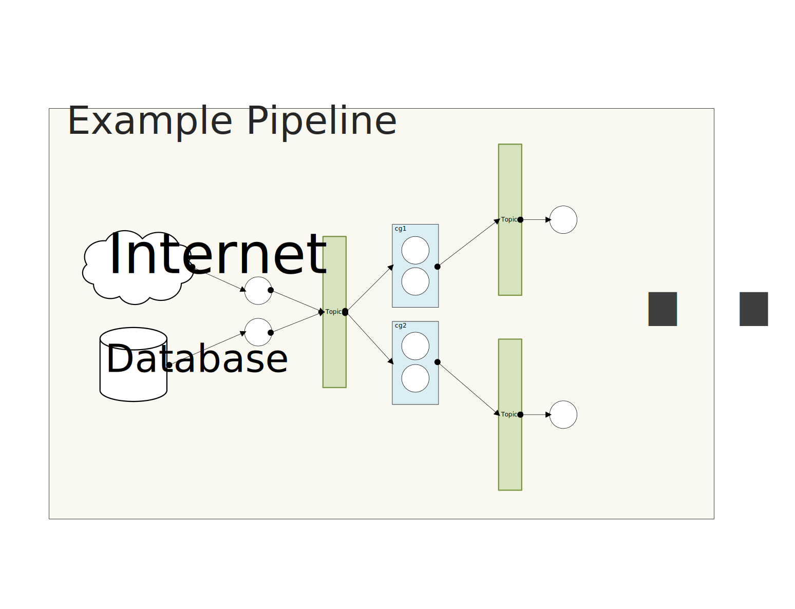

# Kafka Client Package

This is a Python package designed to streamline the interaction with Kafka and provide abstractions for common patterns such as producing/consuming Avro messages, managing Kafka topics, and building Kafka pipelines. It leverages `confluent-kafka` for Kafka operations and integrates with a Schema Registry for managing Avro schemas.





---

## Table of Contents

- [Features](#features)
- [Installation](#installation)
- [Usage](#usage)
  - [Basic Kafka Producer/Consumer](#basic-kafka-producerconsumer)
  - [Kafka Pipeline](#kafka-pipeline)
  - [Cluster Administration](#cluster-administration)
- [Project Structure](#project-structure)
- [Example](#example)
- [Contributing](#contributing)
- [License](#license)


## Features

- **Kafka Producer and Consumer**:
  - Supports Avro serialization/deserialization.
  - Handles schema registry integration.
  
- **Kafka Pipelines**:
  - Build modular pipelines using multiprocessing or Docker containers.
  - Easily define pipeline stages with input and output topics.
  
- **Cluster Administration**:
  - Create and manage Kafka topics using Kafka REST API.


## Installation

1. Clone the repository:
   ```bash
   $ git clone https://https://github.com/dovelleee/kafka-pipeline.git
   $ cd kafka-pipeline/kafka_client
   $ pip install .
   ```

2. Ensure you have Kafka, Schema Registry, and Kafka REST Proxy running in your environment. As a starting point, you can also use either of `kafka_cluster/network-depolyment.yml` or `kafka_cluster/one-machine-deployment.yml` files to easily spin up a kafka cluster. As an example, for running the one machine cluster, simply run the following command from the root directory of the project:
    ```bash
    $ docker compose -f kafka_cluster/one-machine-depolyment.yml up -d
    ```

    Keep in mind that for network deployment, you should provide the host name of the external ip address of you machine in the `.env` file.


## Usage

### The Main Idea
A Kafka pipeline is composed of producers and consumers that work together to process data in a seamless, modular, and scalable way. At its core, a producer is responsible for publishing messages to Kafka topics, while a consumer subscribes to topics, retrieves messages, and performs processing or transformations on the data. Pipelines take advantage of this fundamental producer-consumer model by chaining multiple stages, where the output of one stage (producer) becomes the input for the next stage (consumer). This creates a highly flexible and fault-tolerant flow of data.

Each stage in the pipeline encapsulates a specific processing logic. For example, an initial stage might act as a source, generating or ingesting raw data and publishing it to an input topic. Subsequent stages consume this data, transform or enrich it, and publish the results to output topics. These stages can run as independent processes or services, allowing horizontal scaling and parallelism. By defining clear input and output topics for each stage, pipelines enable modular development, where individual stages can be updated, scaled, or reused without disrupting the rest of the pipeline. This architecture is ideal for real-time data processing workflows, such as log aggregation, stream analytics, ETL tasks, and event-driven applications.

---

### Implementing A Simple Kafka Producer/Consumer

#### Producer Example:
```python
from kafka_client.kafka_client import KafkaProducer

producer = KafkaProducer(topic="test_topic", bootstrap_server="localhost:9092")
producer.publish(key="key1", message="Hello, Kafka!")
```

#### Consumer Example:
```python
from kafka_client.kafka_client import KafkaConsumer

class CustomConsumer(KafkaConsumer):
    def handle_message(self, msg):
        print(f"Received: {msg.key()}: {msg.value()}")

consumer = CustomConsumer(topic="test_topic", group_id="group1", bootstrap_server="localhost:9092")
consumer.listen()
```

***Note that, for creating pipelines, we don't usually use `KafkaProducer` and `KafkaConsumer` classes directly. Instead, we use `PipelineStage`.***

---

### Making A Pipeline

The Kafka Pipeline module allows you to define modular processing stages in a pipeline. Each stage can process data from an input topic, transform it, and send it to an output topic.

#### Creating a stage

For creating a pipeline stage, you need a few elements defined:
- input_topic: This value determines which Kafka topic to listen on.

- output_topic: This value determines what Kafka topic to publish to.
- output_topic_config: This object holds the configurations required for creating the output topic. It is handy for each stage to create its output topic if not exists.
- consumer_group_id: This value defines how consumers interact with the input topic and one another. If all consumers of a certain topic share the same consumer_group_id, they process messages in a task-sharing fashion (of course, `n_partitions` for the input topic must be set to a proper value). Otherwise, consumers with different ids will each receive a particular message. This gives you the flexiblity of having multiple consumer groups listening on one input topic. While all consumer groups receive a message, they do task-sharing within each group.
- `transform` method: It is required for every `PipelineStage` to implement this method. Whenever a message is received by the consumer, it is deserialized according to the input topic schema, and is then passed to this method. ***Note that the return value of your transform method must be aligned with the schema of the output topic.***


Here's an example of a `PipelineStage` class:

```python
from kafka_client.kafka_pipeline.pipeline.pipeline_stage import PipelineStage

class ExampleStage(PipelineStage):

    def __init__(self, kafka_config: KafkaConfig):        
        input_topic = 'test_input_topic'
        output_topic = 'test_output_topic'
        output_topic_config = KafkaTopicConfig(
            topic_name=output_topic,
            n_partitions=2, n_replications=1,
            sr_json_path=os.path.join(SCRIPT_DIR, './schema/test_output_topic.json'))
        consumer_group_id = 'cg1'
        super().__init__(kafka_config, input_topic, output_topic, consumer_group_id, True, output_topic_config)

    def transform(self, msg):
        print(f"Processing: {msg.key()}:{msg.value()}")
        return {"processed": True}
```

Here's the definition of the output topic schema. To read more details about Avro schema, please refer to [this doc](https://avro.apache.org/docs/).

```json
{
    "type": "record",
    "name": "test_output_topic_value",
    "fields": [
        {
            "name": "postid",
            "type": [
                "string"
            ]
        }
    ]
}
```

***Note that, while the output topic's name in `ExampleStage` is set to `test_output_topic`, the schema name in the above json file matches that name but with an extra `_value` at the end, hence `test_output_topic_value`.***

#### Running the stage

To run this stage, either in its own process or in a Docker container, you must call the `.listen()` method on your stage. Remember that this method is synchronous, meaning that the pipeline stage keeps waiting until it receives a new message to consume. Upon receiving the message, it deserializes the message under the hood, and invokes the `.transform(msg)` message.

For creating the first stage of the pipeline, which may have no topic to listen, you can use `SourcePipelineStage` class.

#### Creating a Source Stage
When creating a stage object, we are required to provide the input topic name. However, the first stage of the pipeline might not have an input topic to listen on. This stage only produces messages. For this case, instead of creating a `PipelineStage` object, we use `SourcePipelineStage`. Here's an example:

```python
class ExampleSourceStage(SourcePipelineStage):
    # source stage does not have any input topic, rather it generates a bunch of messages and pushes them to the output topic
    def __init__(self, kafka_config: KafkaConfig):
        output_topic = 'test_source_topic'
        output_topic_config = KafkaTopicConfig(
            topic_name=output_topic,
            n_partitions=4, n_replications=1,
            sr_json_path=os.path.join(SCRIPT_DIR, './schema/test_source_topic.json'))
        super().__init__(kafka_config, output_topic, True, output_topic_config)
    
    def start(self):
        i = 0
        while True:
            msg_value = {
                'value': 'hello'
            }
            self.to_output(f'id_{i}', msg_value)
            i += 1
            sleep(0.1)

```

As you can see in this example, we did not specify any `input_topic`, unline the `PipelineStage`s. Additionally, there is not `transform` method. Instead, we must implement the `.start(self)` method, and always call the `self.to_output(key, msg)` method at the end.

#### Creating a Pipeline

For running an entire pipeline, you can choose to run each within a single process, or on seperate containers/hosts. For the first method, kafka-client provides `MultiProcessPipeline` class that takes care of operating your pipeline. Here's an example: 


```python
from kafka_client.kafka_pipeline.pipeline.kafka_pipeline import MultiProcessPipeline
from kafka_client.kafka_pipeline.pipeline.pipeline_stage import PipelineStage, SourcePipelineStage

class StageOne(SourcePipelineStage):
    # ...

class StageTwo(PipelineStage):
    # ...

class StageThree(PipelineStage):
    # ...


if __name__ == "__main__":
    mpp = MultiProcessPipeline('test_pipeline', [
        lambda: StageOne(kafka_config),
        lambda: StageTwo(kafka_config),
        lambda: StageThree(kafka_config)
    ], delay_between_starts=5)
    mpp.start()
```

If you intend to deploy your pipeline in a containerized environment, you need to create a container for each stage, and possibly manage them with docker compose or k8s. Here's an example docker-compose file:

```yaml
version: '3'

services:
  stage1:
    build: 
      context: .
      dockerfile: ./stage_one/Dockerfile
      
  stage2:
    build: 
      context: .
      dockerfile: ./stage_two/Dockerfile
    depends_on:
      - stage1

  stage3:
    build: 
      context: .
      dockerfile: ./stage_three/Dockerfile
    depends_on:
      - stage2
```

The main advantage of the second approach to running a pipeline is scalability. Whether you choose docker compose or kubernetes, you can easily scale your consumers. In addition, whenever a stage container fails (for whatever reason), you can easily spin up another one.


For working example projects, please refer to [here](./kafka_client/tests/)

---

### Cluster Administration

The `ClusterAdmin` class provides high-level APIs to manage Kafka topics and clusters using Kafka REST Proxy. This method is used by `PipelineStage`s under the hood. Here's an example:

```python
from kafka_client.cluster_admin import ClusterAdmin

admin = ClusterAdmin(kafka_rest_url="http://localhost:8082")

# Get available clusters
clusters = admin.get_clusters()

# Select a cluster
admin.select_cluster(cluster_id=clusters[0])

# Create a new topic
admin.create_topic(topic_name="new_topic", n_partitions=3, n_replications=1)
```

## Contributing

Contributions are welcome! Please follow these steps:

1. Fork the repository.
2. Create a new branch for your feature or bugfix.
3. Submit a pull request with a detailed explanation of your changes.


## License

This project is licensed under the MIT License. See the `LICENSE` file for details.

## Contact
For questions, suggestions, or feedback, please open an issue or contact [roohi.abol@gmail.com](mailto:roohi.abol@gmail.com).